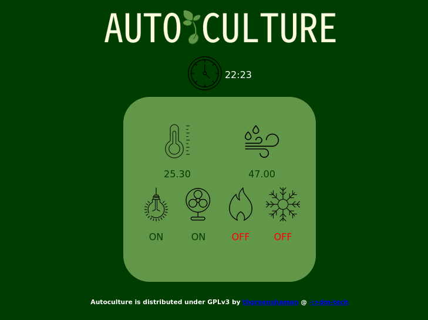

Autoculture for arduino is a basic grow environment controller that is designed for use with <a href="https://www.jaycar.co.nz">JayCars</a> XC4411 Arduino Uno w/ Wifi (Intergrated ESP8266). The .ino files can be flashed to separate Uno and ESP boards then connect them via serial. There is a sample of serial communication between boards at this <a href="https://www.hackster.io/RoboticaDIY/send-data-from-arduino-to-nodemcu-and-nodemcu-to-arduino-17d47a">link</a>

The Autoculture-Arduino is designed to control lighting, fans, heatpad and peltier unit with basic settings in-code. All settings must be adjusted using the in-code variables before flashing to the boards.

Most variables are self explanitory although I will put up some better instructions in the near future.
TODO::The timer is set to turn lights off at 1100 hours and turn on again at 1700 hours.

# Parts I used:

 * <a href="https://www.jaycar.co.nz/uno-with-wi-fi/p/XC4411">Duinotech Uno with Wifi (XC4411)</a>
 * <a href="https://www.jaycar.co.nz/arduino-compatible-data-logging-shield/p/XC4536">Data logging sheild</a>(I only used the RTC on this module, any RTC would suffice although the code may need edited in that case)
 * <a href="https://www.jaycar.co.nz/arduino-compatible-4-channel-12v-relay-module/p/XC4440">4 channel 12v relay module</a>
 * <a href="https://www.jaycar.co.nz/arduino-compatible-temperature-and-humidity-sensor-module/p/XC4520">DHT11 module</a>

# Installation
Installation is as simple as flashing the appropriate files to the right board and uploading the data folder via SPIFFS to the ESP8266 board...

<h3>Prepartion</h3>

* Make sure you have the ESP8266 library installed on your Arduino IDE. There is a good tutorial <a href="https://randomnerdtutorials.com/how-to-install-esp8266-board-arduino-ide/">here</a>
* Install <a href="https://github.com/me-no-dev/ESPAsyncWebServer">ESPAsyncWebServer</a> and <a href="https://github.com/me-no-dev/ESPAsyncTCP">ESPAsyncTCP</a> libraries following instructions on each of the github pages.
* Install ESP8266 filesystem uploader using <a href="https://randomnerdtutorials.com/install-esp8266-filesystem-uploader-arduino-ide/">this tutorial</a>

Thats the hard stuff done!!

 <h3>Installation</h3>

 * Clone or download <a href="https://github.com/thgreenshaman/Autoculture-Arduino/">repo</a>.
 * Configure /esp/config.h with your WiFi credentials.
 * Flash uno.ino to your Arduino Uno and esp.ino to your ESP8266.
 * Upload web files in data folder using SPIFFS.
  * Once ESP8266 .ino file has been flashed connect push the reset button and connect to computer serial to check which IP the server has connected to. This is the address of the display interface.
 * Connect DHT 11 module signal to pin 2, vcc to 3v, gnd to gnd.
 * Connect relay board pins and power. Be sure to connect the correct power cables as the board I used has a 12v input from an external source and also 5v from arduino. Be sure to check the instructions for your particular relay module.
 The four relays are set as:
 <table align="center">
   <tr>
    <th>Fan relay</th>
    <td>Pin 6</td>
   </tr>
   <tr>
    <th>Light relay</th>
    <td>Pin 7</td>
   </tr>
   <tr>
    <th>Heatpad Relay</th>
    <td>Pin 8</td>
   </tr>
   <tr>
    <th>Peltier Relay</th>
    <td>Pin 9</td>
   </tr>
 </table>

 You should be done!

 # Screenshot
 

 

 

 

</body>
